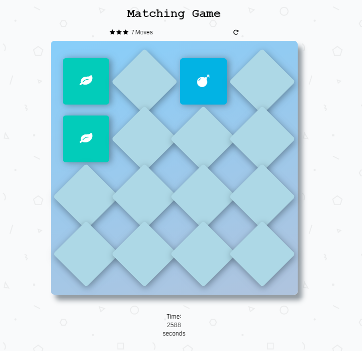

Matching Game
===

This project was done as a part of the Udacity Front-End Web Developer Nanodegree Program.
The starter file for this project is located at https://github.com/udacity/fend-project-memory-game

Installation
---

To download this game,
1) Click the Clone or Download button then Download Zip.
2) Once downloaded, open the file and click on the index.html file to open the game on your browser.

How to play
---
The aim of the game is to find all the Matching pairs of the icons.
1) Click on the cards to reveal their respective icons.
The timer at the bottom of the page will start once the first card is clicked.

2) You can choose two cards at a time. If the chosen cards have matching icons then a match has been found and the matching cards will remain open. Continue to find matched pairs until all the cards remain open to win the game.

3) Find all the matches in as few moves as possible.
Number of moves made are displayed at the left hand corner.

Stars are awarded depending on the number of moves made. Finishing the game in less than 25 moves are awarded 3 stars, finishing in less than 35 moves are awarded 2 stars. If number of moves exceed 35 moves one star is awarded.

To Restart the game at any point, click on the replay icon in the righthand corner.
